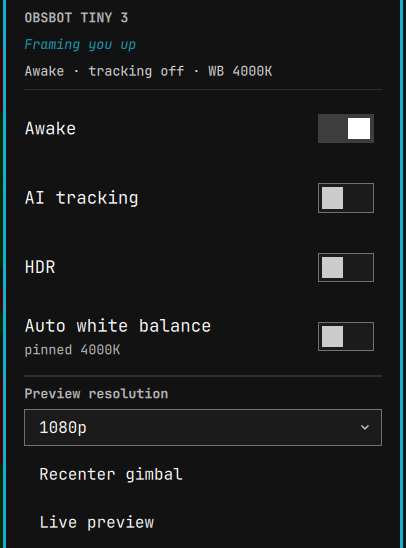

# obsbot-tiny3-linux

Linux control suite for the **OBSBOT Tiny 3 series** webcam — sleep/wake, AI
tracking, gimbal, and white balance from the command line, with first-class
[Omarchy](https://omarchy.org/)/Hyprland integration.

OBSBOT Center is Windows/macOS-only. The excellent
[Tiny4Linux](https://github.com/OpenFoxes/Tiny4Linux) covers the Tiny 2. This
fills the gap for the **Tiny 3 generation**, whose USB control protocol turned
out to be the same UVC extension-unit vendor protocol as the Tiny 2 — cracked
and verified here against a real Tiny 3 Lite. The full wire protocol is
documented in [`PROTOCOL.md`](PROTOCOL.md).

> **The #1 missing feature on Linux — a real camera sleep — works here.** No more
> lingering LED and live gimbal when nothing is using the camera.

<p align="center">
  
  <br><em>The Omarchy bar widget: sleep/wake, AI tracking, HDR, white balance, a preview-resolution picker, and a live preview.</em>
</p>

## Features

| Feature | `t3ctl` | Notes |
|---|---|---|
| **Sleep / wake** | `t3ctl sleep` / `wake` / `toggle` | Real vendor sleep: LED off, gimbal parks |
| **AI tracking** | `t3ctl track on\|off\|<mode>` | normal, upper/lower body, close-up, headless, group, hand, whiteboard, desk |
| **Gimbal** | `t3ctl pan/tilt/zoom`, `recenter` | Absolute PTZ + named presets |
| **White balance** | `t3ctl wb temp <K>` / `wb auto` | Manual color temperature, quirk-safe |
| **HDR / FOV / exposure** | `t3ctl hdr`, `fov`, `exposure` | |
| **Status** | `t3ctl status` / `info` | Reads state without waking the camera |
| **Settings guard** | `t3-wb-guard` | Enforces saved power, tracking, HDR and WB; protects audio-only calls |

## Supported models

The Tiny 3 family shares one control protocol; only the USB product ID differs.
Please [report results](CONTRIBUTING.md) for your model.

| Model | USB ID | Status |
|---|---|---|
| OBSBOT Tiny 3 Lite | `3564:ff04` | ✅ **Verified** on real hardware (firmware 0510) |
| OBSBOT Tiny 3 | `3564:????` | ⚠️ Expected to work — needs a tester (add its PID) |
| OBSBOT Tiny 3 SE | `3564:????` | ⚠️ Expected to work — needs a tester (add its PID) |
| OBSBOT Tiny 2 / 2 Lite | `3564:fef8` / … | ↔️ Use [Tiny4Linux](https://github.com/OpenFoxes/Tiny4Linux) (same protocol family) |

The tool matches any camera whose `/dev/v4l/by-id` name contains
`OBSBOT_Tiny_3`, so Tiny 3 / Tiny 3 SE are auto-detected; only the udev rule
needs their product ID added (one line — see [`CONTRIBUTING.md`](CONTRIBUTING.md)).

## Install

Every release is an **immutable tag** with checksummed, provenance-attested
assets — statically linked binaries for `x86_64` and `aarch64`, `.deb` / `.rpm` /
Arch packages, and a source tarball the PKGBUILD pins by `sha256`. Nothing in
the install path tracks a mutable branch. See
[**Releases**](https://github.com/joshualambert/obsbot-tiny3-linux/releases).

### Prebuilt binaries (any distro)

```bash
VER=0.1.0
ARCH=x86_64          # or: aarch64
REL=https://github.com/joshualambert/obsbot-tiny3-linux/releases/download/v$VER

curl -fLO "$REL/obsbot-tiny3-linux-$VER-$ARCH-linux-musl.tar.gz"
curl -fLO "$REL/SHA256SUMS"
sha256sum --check --ignore-missing SHA256SUMS      # must print: OK

tar xzf "obsbot-tiny3-linux-$VER-$ARCH-linux-musl.tar.gz"
cd "obsbot-tiny3-linux-$VER-$ARCH-linux-musl"
./install.sh                       # installs to ~/.local/bin, enables the WB guard
sudo ./packaging/install-root.sh   # udev rule + system config (one-time, needs root)
```

Every asset also carries a [Sigstore build-provenance
attestation](https://docs.github.com/actions/security-guides/using-artifact-attestations),
which proves it was built by this repo's release workflow from that tag:

```bash
gh attestation verify "obsbot-tiny3-linux-$VER-$ARCH-linux-musl.tar.gz" \
  --repo joshualambert/obsbot-tiny3-linux
```

The binaries are static (musl), so the tarball, `.deb` and `.rpm` have no
runtime library dependencies. `mpv` is only needed for the optional
`t3-preview` self-view window.

### Distro packages

```bash
# Debian / Ubuntu
sudo apt install ./obsbot-tiny3-linux_${VER}_amd64.deb
# Fedora / RHEL
sudo dnf install ./obsbot-tiny3-linux-${VER}.x86_64.rpm
# Arch — the prebuilt package, or build from the pinned PKGBUILD
sudo pacman -U ./obsbot-tiny3-linux-${VER}-1-x86_64.pkg.tar.zst
```

Then, per user: `systemctl --user enable --now t3-wb-guard.service`.

Arch users who prefer to build from source can take the `PKGBUILD` published
with each release (also committed at
[`packaging/PKGBUILD`](packaging/PKGBUILD)). It pins the release's own source
tarball by `sha256` — no `SKIP`, and no dependency on GitHub's regenerable
`/archive/` tarballs:

```bash
curl -fLO "$REL/PKGBUILD" && makepkg -si
```

### From a git checkout (development)

Requires a Rust toolchain (`rustup` or the `rust` package) and `v4l-utils`
(optional, for cross-checking). Use this if you are hacking on the code; for
a normal install prefer a release above, so you get a verifiable artifact.

```bash
git clone https://github.com/joshualambert/obsbot-tiny3-linux
cd obsbot-tiny3-linux
git checkout v0.1.0                # pin to a release rather than tracking main
./install.sh                       # builds + installs to ~/.local/bin
sudo ./packaging/install-root.sh   # udev rule + system config (one-time, needs root)
```

`./install.sh` installs `t3ctl`, `t3-wb-guard` and `t3-preview` to
`~/.local/bin` plus a per-user systemd unit; it needs no root and writes nothing
outside your home. Make sure `~/.local/bin` is on your `PATH`. The system-wide
default config lives at `/etc/obsbot-tiny3/config`; override it per user in
`~/.config/obsbot-tiny3/config`.

## Usage

```bash
t3ctl sleep                  # camera off (LED off, gimbal parks)
t3ctl wake                   # back on
t3ctl toggle                 # sleep <-> wake (prints the new state)
t3ctl status                 # current state (does NOT wake a sleeping camera)
t3ctl info                   # serial number, UUID

t3ctl track on               # AI subject tracking
t3ctl track upper            # upper-body framing
t3ctl track off

t3ctl pan 20                 # absolute pan, degrees (-130..130)
t3ctl tilt -10               # absolute tilt (-90..90)
t3ctl zoom 60                # 0..100
t3ctl recenter               # gimbal back to center
t3ctl preset save desk       # remember current pan/tilt/zoom
t3ctl preset recall desk

t3ctl wb temp 4000           # manual white balance, 4000K
t3ctl wb auto                # auto white balance (safe fallback)
t3ctl hdr on
t3ctl exposure auto          # or: t3ctl exposure 330

t3ctl --json status          # machine-readable output
```

Run `t3ctl --help` for the full command list.

### Persistent settings and call protection

`t3-wb-guard` keeps its historical service name, but now reconciles power,
tracking, HDR and white balance every second. `t3ctl` saves these choices in
`~/.config/obsbot-tiny3/config`; the guard reloads changes without a restart.
CLI and guard operations share a lock so they cannot overwrite one another
mid-command. Commands check camera readback and report failures; a saved
setting remains pending if firmware rejects it, and the guard retries.

- `t3ctl wake`: stay awake, including without a video preview, until Sleep/Auto.
- `t3ctl sleep`: explicit sleep overrides active calls and firmware wake attempts.
- `t3ctl auto`: wake when an app uses video **or the camera microphone**; release
  the keep-awake descriptor when idle. This is the default for existing configs.
- `t3ctl track off`: tracking stays off during use even if firmware changes it.
- `t3ctl wb auto`: auto WB now stays selected; the guard no longer fights it.

The guard matches ALSA capture to the same physical USB device as the camera,
so changing sound-card numbers or using a different microphone is safe. It
reads capture activity from procfs; it does not record or start video capture.
Defaults are tracking off and manual WB at 4000K. HDR remains unmanaged until
explicitly selected. Power transitions wait for vendor readback.

Reconciliation is corrective, not an atomic firmware lock: external voice,
gesture or app changes can take effect briefly before the next guard tick.
The vendor controls for disabling voice/gesture triggers and changing onboard
microphone DSP are not implemented. Camera unplug/replug is rediscovered.

### Optional call microphone (PipeWire)

`packaging/install-audio.sh` installs a separate user service exposing
**OBSBOT Calls (Noise + Echo Reduction)**. It uses PipeWire's WebRTC echo
canceller, high-pass filter and noise suppression, with the speaker monitor as
an echo reference. It targets the Tiny 3 Lite's stable source name, never an
unrelated fallback microphone. Edit the target for other models.

```bash
./packaging/install-audio.sh
pactl set-default-source obsbot_calls
```

Select this source in call apps that retain an explicit microphone selection.
Keep raw hardware gain at or below 100%; raising it further cannot recover
speech removed by the camera's onboard processing. Avoid layering aggressive
app noise suppression on top of the processed source. Listening to a real
call is still required to tune speech quality; stream checks alone do not
establish intelligibility. PipeWire and its WebRTC AEC plugin are required.

The filter runs as a separate client, so installing it does not restart the
audio server. It releases the hardware when no app is using the source.
To undo: select the original microphone and run
`systemctl --user disable --now t3-audio.service`.

## Omarchy / Hyprland integration

- **Quickshell bar widget** — a native camera widget for the Omarchy bar (a
  webcam icon that opens a popup with toggle switches for sleep/wake, AI
  tracking, HDR, and auto white balance, a preview-resolution dropdown, recenter,
  and a **Live preview** button). It's a **separate, optional** add-on with its
  own repo/marketplace listing (it depends on the `t3ctl`/`t3-preview` commands
  this project installs):
  **[joshualambert/omarchy-obsbot-tiny3](https://github.com/joshualambert/omarchy-obsbot-tiny3)**
  ```bash
  omarchy plugin install io.github.joshualambert.obsbot-tiny3   # once listed in the marketplace
  ```
  `install.sh` does **not** install the widget — it only points you here if it
  detects Omarchy, so the CLI stays clean on non-Omarchy distros (Ubuntu, Debian…).
- **Live preview** — `t3-preview [WxH]` opens a small, pinned, corner self-view
  (mpv) that streams only while open and releases the camera on close, so it
  doesn't defeat sleep. The Hyprland float rule is in
  [`packaging/hypr/windows.omarchy.lua`](packaging/hypr/windows.omarchy.lua).
- **Keybindings** — copy from [`packaging/hypr/bindings.omarchy.lua`](packaging/hypr/bindings.omarchy.lua)
  into `~/.config/hypr/bindings.lua` (or the vanilla `.conf` form in the same
  directory). Defaults, all unbound in stock Omarchy:
  - `SUPER + ALT + C` — camera sleep toggle (with a notification)
  - `SUPER + ALT + R` — recenter gimbal
  - `SUPER + ALT + T` — tracking toggle
- **Menu** — merge [`packaging/omarchy-menu.jsonc`](packaging/omarchy-menu.jsonc)
  into `~/.config/omarchy/extensions/omarchy-menu.jsonc` for a **Camera** submenu (under the **Trigger** menu).
- **systemd** — [`packaging/systemd/t3-wb-guard.service`](packaging/systemd/t3-wb-guard.service)
  is a hardened per-user unit.

## Firmware quirks (the hard-won ones)

These cost real time to discover; they are documented in full in
[`PROTOCOL.md`](PROTOCOL.md) and encoded in the code:

1. **Last-written-control-wins white balance.** You must write
   `white_balance_temperature` *last*, with nothing after it. Writing
   red/blue balance afterwards turns them into literal channel gains — a
   saturated **neon-green** image, while the control readbacks still look fine.
   `t3ctl` and the guard always use the safe order and never touch red/blue.
2. **Starting a capture wakes the camera; control reads don't.** `t3ctl status`
   and `info` read a sleeping camera without waking it. Only a real video
   stream (a browser, ffmpeg) wakes it.
3. **Pan/tilt readback is cached by uvcvideo**, so `recenter` is done via the
   UVC pan/tilt controls (not the vendor recenter frame) to keep readback honest.
   One consequence: after **AI tracking** physically moves the gimbal, the UVC
   readback still shows the last host-commanded angle, so `t3ctl status` and
   `preset save` reflect that cached value, not where tracking actually pointed.
   Save presets from a position you set with `t3ctl pan/tilt`, not mid-track.

## How it works

The camera exposes a UVC extension unit (bUnitID 2, GUID
`9A1E7291-6843-4683-6D92-39BC7906EE49`). Vendor commands are 60-byte framed
"V3" messages (magic `0xAA`, CRC-16/USB checksums) on selector 2; simpler
settings (AI tracking, HDR, FOV) are raw TLVs on selector 6; standard image and
PTZ controls are plain V4L2/UVC. No proprietary SDK is required — this is a
clean-room implementation from community protocol notes. See
[`PROTOCOL.md`](PROTOCOL.md) for every command, byte, and dead end.

## Acknowledgments

This project stands on prior reverse-engineering work:

- **[OpenFoxes/Tiny4Linux](https://github.com/OpenFoxes/Tiny4Linux)** (EUPL-1.2)
  — the Tiny 2 control tool; its command frames were the Rosetta stone for the
  V3 protocol.
- **[lxman/obsbot-mcp](https://github.com/lxman/obsbot-mcp)** (MIT) — the most
  complete public write-up of the Tiny 2 UVC-XU protocol (frame format, CRC,
  command table).
- **[samliddicott/meet4k](https://github.com/samliddicott/meet4k)**,
  **[cgevans/tiny2](https://github.com/cgevans/tiny2)**, and
  **[taxfromdk/obsbot_tiny_reversing](https://github.com/taxfromdk/obsbot_tiny_reversing)**
  — the lineage of OBSBOT XU reverse-engineering.

Protocol *facts* (opcodes, CRC parameters, frame layout) are not copyrightable;
all code here is original and MIT-licensed.

## Contributing

Tiny 3 and Tiny 3 SE owners: **please test and report** — see
[`CONTRIBUTING.md`](CONTRIBUTING.md). Even a `t3ctl info` + `t3ctl status` dump
and your USB product ID helps confirm the model matrix.

## License

MIT — see [`LICENSE`](LICENSE).
